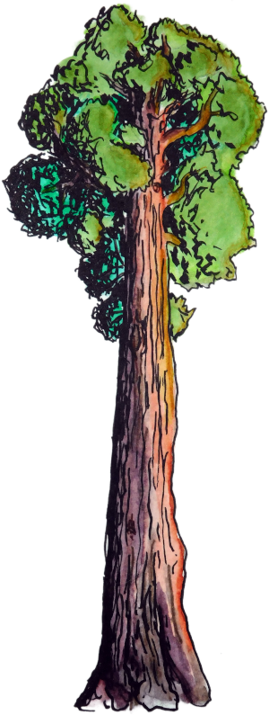

</img>

### BigTrees

A rewrite of [gander](https://github.com/jefdaj/gander) focusing more on
usability of the data structures as a library, rather than on my own "dedup
backups" use case.


#### Quick Start

``` .sh
git clone https://github.com/jefdaj/bigtrees
cd bigtrees
nix-shell
stack test
```

#### Done

* Moved `Gander.Cmd` -> `BigTrees.OldCmd`, leaving old commands functional during the rewrite
* Wrote a meta lint script (hlint, stan, stylish-haskell, weeder) and applied some basic suggestions
* Some initial work in progress writing haddocs
* Moved tests into lib/ + app/ alongside the functions they test, wrote more of them
* Broke HashTree into smaller modules by operation: Build, Write, etc
* Rewrote my old directory-tree code using a typeclass, started [a PR upstream](https://github.com/jberryman/directory-tree/pull/18)
* Wrote comparison of text vs binary format file sizes, realized binary is always larger, removed it


#### Todo

* Rewrite command line interface
* Add more metadata to trees: besides `nFiles`, also want mod time and size in bytes
* Add `Graft` nodes that import other tree files
* Add `Link` nodes that indicate whether their target data is present in the tree
* Add `Error` nodes to wrap errors, the same way directory-tree does it
* Static build so it can be used offline without Nix
* Intelligent re-hashing of only the files whose mod times have changed
* "`find` mode": list full paths, filter by metadata and glob/regex
* Upload to Hackage
