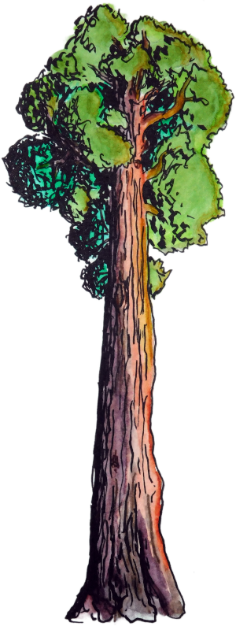

</img>

### BigTrees

A re-imagining of [gander](https://github.com/jefdaj/gander) that gives up on
some aspirational "easy mode" features in favor of simplicity for power users.

The core data structures and algorithms perform very well already!
In fact I'm not aware of any open source program that's better at large-scale file deduplication.
(Scale is mainly limited by your RAM; I've tried up to ~15 million files on my laptop which required ~30G)

Now the main things left to do are:

- clean up the interface
- get all the tests passing
- write some documentation


#### Quick Start

``` .sh
git clone https://github.com/jefdaj/bigtrees
cd bigtrees
```

``` .sh
# incremental dev build using nix + stack
nix develop
stack repl
stack build
stack exec bigtrees -- <bigtrees args>
stack test # TODO fix failing tests
```

``` .sh
# final static build for use outside a nix environment
nix build
ldd result/bin/bigtrees # should say "not a dynamic executable"
```

```.sh
# update the website
# uncomment the bigtrees-doc-site target in package.yaml first
stack build --flag bigtrees:build-docs-site
stack exec bigtrees-docs-site build
```

``` .sh
# benchmarking
# TODO still works?
stack bench --ba --baseline=test/bench/bench.csv --timeout=60s
```

#### Development

TODO:

- [x] Move `Gander.Cmd` -> `BigTrees.OldCmd`, leaving old commands functional during the rewrite
- [x] Write a meta lint script (hlint, stan, stylish-haskell, weeder) and applied some basic suggestions
- [x] Some initial work in progress writing haddocs
- [x] Move tests into lib/ + app/ alongside the functions they test, wrote more of them
- [x] Break HashTree into smaller modules by operation: Build, Write, etc
- [x] Rewrite my old directory-tree code using a typeclass, start [a PR upstream](https://github.com/jberryman/directory-tree/pull/18)
- [x] Write comparison of text vs binary format file sizes, realize binary is always larger, remove it
- [x] Add mod time, size (bytes), n files (nodes) to tree data
- [x] Add header + footer to hashes describing filters, version used, start/end time, table format
- [x] Rename data structures: Depth, NFiles, NBytes
- [x] Static build so it can be used offline without Nix
- [x] "`find` mode": list full paths, filter by metadata and glob/regex
- [ ] Rewrite command line interface
- [ ] Add `Graft` nodes that import other tree files
- [x] Add `Link` nodes that indicate whether their target data is present in the tree
- [x] Add `Error` nodes to wrap errors, the same way directory-tree does it
- [ ] Intelligent re-hashing of only the files whose mod times have changed
- [ ] Clean up: write haddocks, hide partial constructors, etc
- [ ] Upload to Hackage
- [ ] Example screencasts of using the binary + data structures in repl

```
bigtrees hash   <src> [-o <tree>]
bigtrees update <tree> [-i <src>]
bigtrees cut    <tree> <branch> [-o <tree>]
bigtrees rm     <tree> <branch>
bigtrees graft  <tree> <branch> [-i <tree>]
bigtrees mv     <tree> <oldbranch> <newbranch>
bigtrees diff   <oldtree> <newtree>
bigtrees dupes  <tree> [<condition>..] [-s <sortby>] [-n <nhits>] [-p <branch>] [-d <script>]
```
